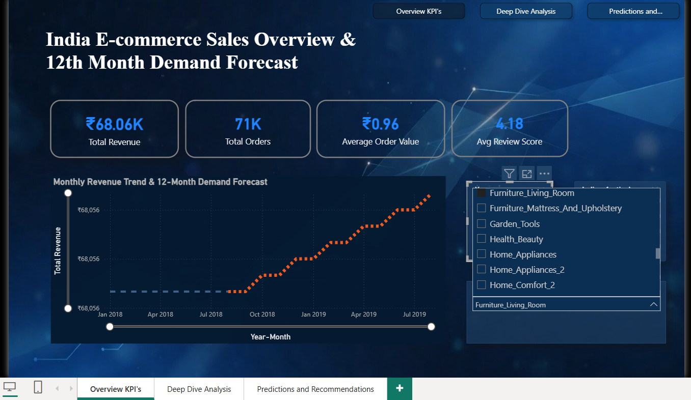

# India E-commerce Sales Forecasting Dashboard
**Power BI | Interactive 3-Page Dashboard with Demand Forecasting**

### Live Dashboard
https://app.powerbi.com/view?r=eyJrIjoiYzQ0NWVmNTgtNDkzMi00ZjFjLWEzOGQtZTY0NzEzZmVlMmNjIiwidCI6IjMxZDg4NTRiLTcxZTAtNDc1ZC1iOTY4LTdkYzE2MTE5N2RiNSJ9&pageName=ef0b1ec6b747f0469038

---
### Project Overview
I built this end-to-end interactive Power BI dashboard to analyze e-commerce sales and forecast future demand using the Olist dataset. I added an Indian festival season angle and what-if growth scenarios to make it more relevant for real business decisions.

---
### Key Features

**Page 1: Overview KPIs & Trend Forecast**

- KPI cards (Total Revenue, Orders, AOV, Avg Review Score)
- Monthly revenue trend with 12-month built-in forecasting (95% confidence interval)
- Interactive slicers (Year, Festival Season, Product Category)

**Page 2: Deep Dive Analysis**

- Top Product Categories by Revenue (sorted descending)
- Revenue by State (Brazil map with SP as highest contributor)
- Revenue by Payment Type (donut chart)
- Review Sentiment analysis (matrix with conditional formatting)

**Page 3: Predictions & Recommendations**

- Interactive What-If Growth Rate Slider (0% to 30%)
- Forecasted top revenue by categories
- Actionable business recommendations based on scenarios

---
### Technical Highlights
- Data Modeling: Star schema with 7 related tables
- Power Query: Data cleaning, custom columns (Indian Festival Season flag, Review Sentiment grouping)
- DAX: Time intelligence, YoY growth, what-if parameters, forecasting logic
- Visuals: KPI cards, line chart with forecast, map, column chart, donut, matrix
- Interactivity: Slicers + what-if slider + navigation buttons

---
### Business Insights
- Diwali and New Year seasons drive significantly higher revenue — recommend 20% extra inventory during these periods.
- SP state contributes the highest revenue — focus marketing efforts here.
- Top categories: Health Beauty, Watch gifts, Computers Accessories.
- Categories with poor reviews need quality improvement to reduce returns.
 
---
### Tools Used
- Power BI Desktop
- Power Query (ETL)
- DAX (measures and what-if parameters)

---
### How to Use
1. Download the `.pbix` file
2. Open in Power BI Desktop
3. Explore all 3 pages and try the growth rate slider on Page 3

---
**Built by Amrutha**
During my career break, I focused on building practical data analytics projects. This dashboard demonstrates my ability to clean data, build models, create forecasts, and provide business recommendations.
